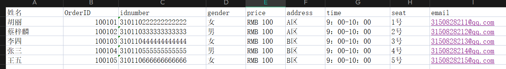
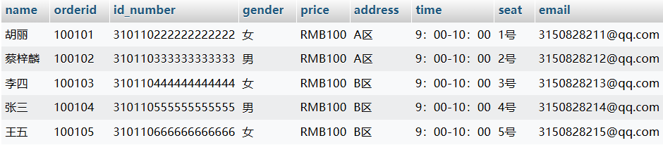
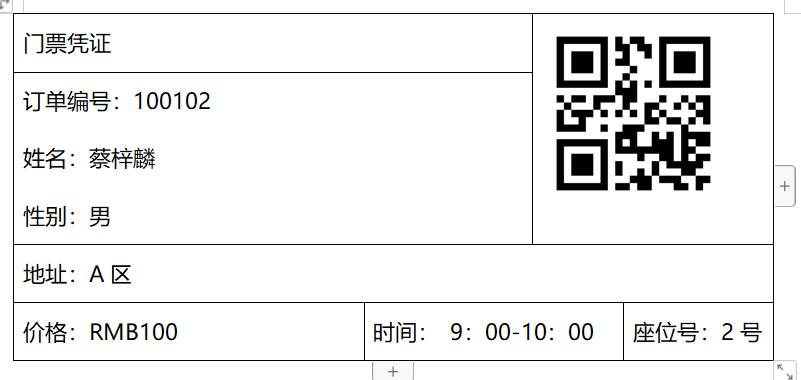
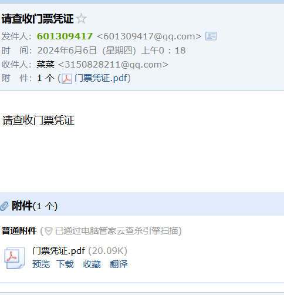

# 门票发布系统
* ## 项目概述
这是我在学习 java  的过程中，结合所学的知识设计开发的门票发放系统，旨在对数据库中大量数据进行整合，制作为电子门票，并自动发放到买家电子邮箱中。
* ## 项目描述
1. 利用 POI将 xlsx  文件中的大量数据读取到数据库中；  
*xlsx文件：*  
  
*成功读取到数据库：*  

2. 采用 Druid  数据库连接池连接数据库，从数据库中提取数据；  
```angular2html
    /**
	 * 初始化连接池
	 * @throws Exception
	 */
	public static void init() throws Exception {
		Properties properties = new Properties();
		
		InputStream in = ConnectionFactory.class.getClassLoader().getResourceAsStream("druid.properties");  
		properties.load(in); 		
		dataSource = (DruidDataSource)DruidDataSourceFactory.createDataSource(properties);		
		
		in.close();
	}
```
3. 利用 POI写 docx  文件、iText  读写 pdf  文件、ZXing  生成二维码，制作对应的 docx  格式和 pdf  格式的电子门票文件；  
*生成docx门票凭证：*  

4. 利用 Java Mail  将电子门票的 pdf  文件发送到买家的电子邮箱中。  
*成功在邮箱中接收到：*  

* ## 项目结果
通过了开发该系统，融会贯通了自己所学的知识，该系统使大量的文件数据更加容易进行整合处理，并将生成的门票自动发送到客户邮箱，节省了大量人力和物力。